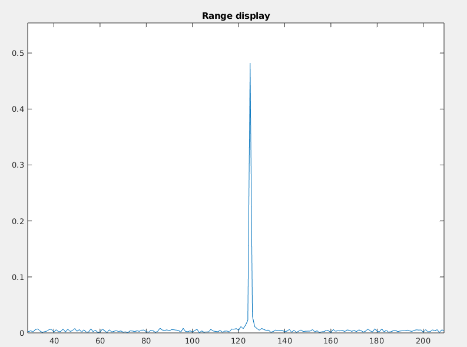
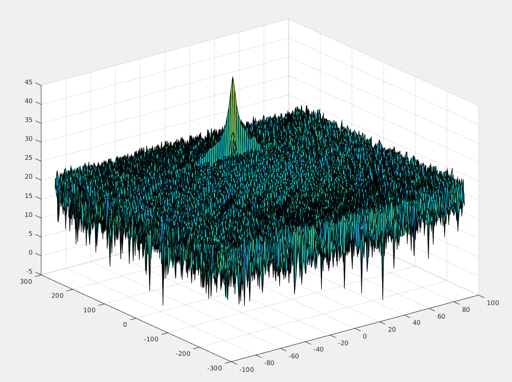
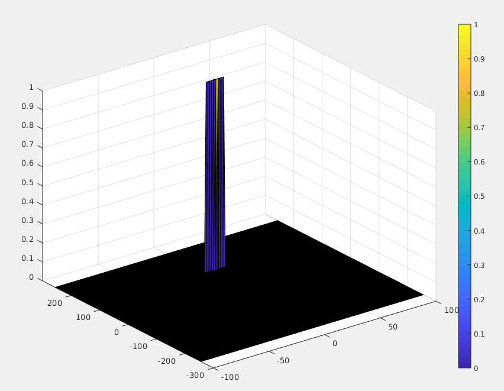

The aim of this project is to:

- Configure the FMCW waveform based on the system requirements.
- Define the range and velocity of target and simulate its displacement.
- For the same simulation loop process the transmit and receive signal to determine the beat signal
- Perform Range FFT on the received signal to determine the Range
- Towards the end, perform the CFAR processing on the output of 2nd FFT to display the target.

After simulating the displacement of the vehicle (constant velocity) and the Rx and TX waveforms, we run the FFT on the beat signal along the range bins dimension (Nr):

The Range Doppler Map (RDM) generated is the following:

In order to filter out the noise we applied 2D CA-CFAR - 2D Cell Averaging Constant False Alarm Rate. CA-CFAR consists of the following steps:

- First, we define a 2D sliding window consisting of three types of cells - training cells, guard cells and cell under test (CUT). After some tests, we ended up with the following values : Training Cell Range & Doppler = 8 Guard cell Range & Doppler = 4, offset = 6. Although the size of the matrix (NrxNd) is not a square we kept the same values for Range and Doppler. In order to get rid of the false positives, We had to increase both the number of training cells and the offset.
    
- Second, we compute the average noise level for all the training cells to obtain the threshold. To do that we 1) sump up over all the sliding window then 2) sum up over the Guard + CUT cells and  take the difference in order to obtain the noise over the training cells only;
    
- Finally the signal level at the CUT cell is compute and compared to the threshold. If the signal is greater that the threshold, the value of the corresponding cell in the matrix, referred to as "cfar_output", is set to 1, otherwise - 0.

Since cells on the border of the "cfar_output" matrix updated by the CA-CFAR algorithm will not be thresholded, the matrix has been created  and initialized with zeros before applying the sliding window to RDM.

The output of CA-CFAR is the following:

